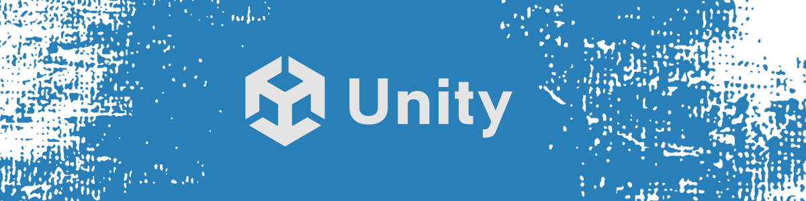

---

## UnityTimelapse – [Repo](https://github.com/cfrBernard/UnityTimelapse)

  

Simple script designed to quickly create timelapses in Unity HDRP. Ideal for presenting scenes, cinematics, or testing lighting variations without using Timeline. Version `0.4.4` -> Has only a directional light rotation, volumetric cloud offset animation and water simulation speed.

---

## UnityLiteL10n – [Repo](https://github.com/cfrBernard/UnityLiteL10n)

  

  

A minimal JSON-Based localization tool for Unity – Designed for small projects. Version `0.6.0` -> This tool currently supports static text only. Variables, plurals, and advanced formatting are not implemented yet.

---

## Core Framework – [Repo](https://github.com/cfrBernard/FA-HD-3D)

  

  

Custom Unity Core Framework – A central framework for Unity, fully modular and data-driven. Includes a full suite of managers, robust boot and loading systems, a comprehensive save system, and a fully configurable settings menu. Designed to accelerate development, maintain flexibility, and centralize all the essential features of an Unity project.

---

## MaskMapWizard_Unity – [Repo](https://github.com/cfrBernard/MaskMapWizard_Unity)

  

 

C# Script designed to help you create Mask Maps by combining multiple textures into a single RGBA image. It’s a powerful solution for optimizing textures in Unity HDRP. – [My Python alternative.](https://github.com/cfrBernard/MaskMapWizard)

---

## Basketball Arcade Game – [Repo](https://github.com/cfrBernard/EX-BS-3D)

  

  

This project is a small physics-based basketball arcade game, made as a first experiment with Unity 3D. It was developed solo in under a week, with a focus on game feel, polish, and rapid iteration.

---

## Triple Triad FanGame – [Repo](https://github.com/cfrBernard/TT-HD-3D)

  

   

Triple Triad FanGame attempt, in the original universe "TES" by Bethesda. Based on the excellent "Triple Triad Card Game in Skyrim" mod for Skyrim, by dylbill, and it's enhance "Triple Triad in Skyrim - Tamriel Edition" by JustIChris.

---

## Platformer_2D – [Repo](https://github.com/cfrBernard/Platformer_2D)

  

  

2D Platformer Game Project, using Unity. It draws inspiration from Metroidvania games and classic platformers, while aiming to explore a deeper narrative. The project is currently in the prototyping phase, with a strong focus on smooth character movement and exploring advanced gameplay mechanics.

---

