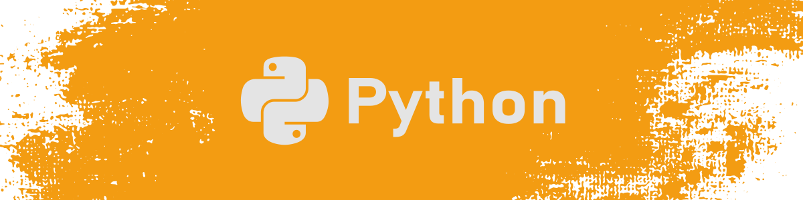
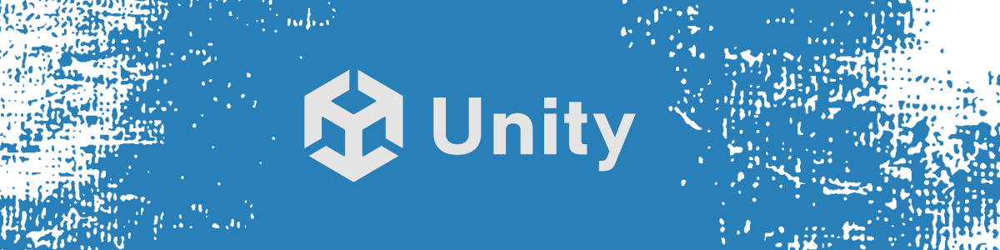
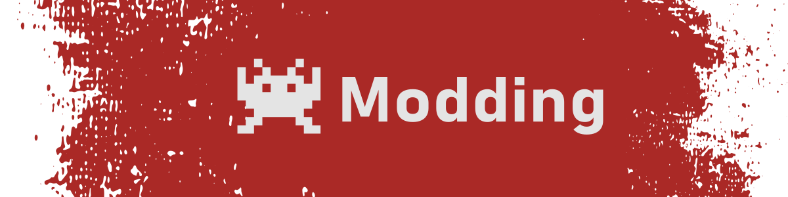
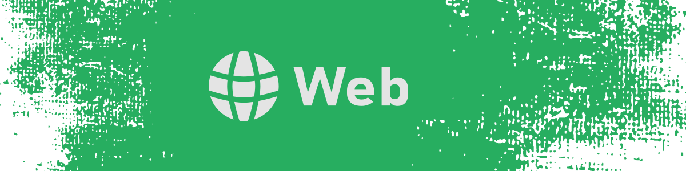

# My Projects

### A curated overview of my open-source work.  

> Most of my repositories are referenced here by category, but not all of them (due to licensing, private work, unfinished or experimental projects).

---

  
> Open-source tools, scripts and automation projects.

---

  
> Game development and interactive applications using C#.

---

  
> Tools and utilities built around existing games and platforms.

---

  
> Experiments and projects with web technologies (JSX, HTML/CSS/JS).

---

_"Always building, sometimes finishing."_  

[⬅️ Back to my GitHub profile](https://github.com/cfrBernard)
